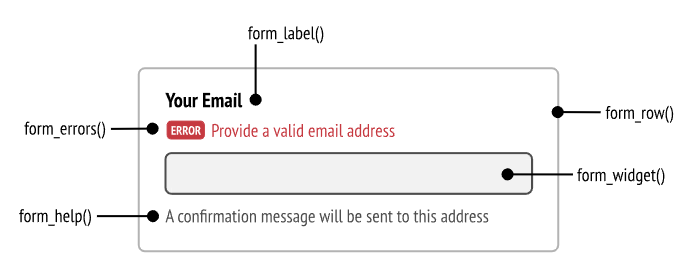

# E12

## Challenge Clé

### Erreur metadata

```text
The metadata storage is not up to date, please run the sync-metadata-storage command to fix this issue.
```

Je n'ai pas changé la chaine de connexion, je dois préciser mariadb

```text
?serverVersion=mariadb-10.3.25&charset=utf8mb4
```

### Erreur class does not exist

```text
require_once dirname(__DIR__).'/vendor/autoload_runtime.php';
Class App\Controller\CarRepository does not exist
```

J'ai fait un copier/coller sans avoir rajouter les use

Si je ne sais pas où est le problème (dans quel fichier), le message d'erreur m'indique 2 choses:

* App\Controller => le namespace dans lequel il y a l'erreur, dans ce cas un controller
* CarRepository => la classe qui n'a pas son use

Je me met à la fin de chaque classe, j'utilise l'auto-complétion (ctrl+espace) pour que VSCode me propose de rajouter les use.

### erreur affichage formulaire novalidate

```text
Arguments must be separated by a comma. Unexpected token "punctuation" of value ":" ("punctuation" expected with value ",").
```

j'ai mal écrit l'ajout d'attribut

```twig
{{ form_start(formulaire, attr: {novalidate: 'novalidate'}) }}
{{ form_start(formulaire, {attr: {novalidate: 'novalidate'}}) }}
```

### erreur BrowserKit

```text
Cannot autowire argument $request of "App\Controller\CarController::add()": it references class "Symfony\Component\BrowserKit\Request" but no such service exists.
```

### aide formulaire



[la doc](https://symfony.com/doc/current/form/form_customization.html)

## Autorisation

```bash
composer require security
```

```bash
bin/console make:user

 The name of the security user class (e.g. User) [User]:
 > 

 Do you want to store user data in the database (via Doctrine)? (yes/no) [yes]:
 > 

 Enter a property name that will be the unique "display" name for the user (e.g. email, username, uuid) [email]:
 > 

 Will this app need to hash/check user passwords? Choose No if passwords are not needed or will be checked/hashed by some other system (e.g. a single sign-on server).

 Does this app need to hash/check user passwords? (yes/no) [yes]:
 > 

 created: src/Entity/User.php
 created: src/Repository/UserRepository.php
 updated: src/Entity/User.php
 updated: config/packages/security.yaml

           
  Success! 
           

 Next Steps:
   - Review your new App\Entity\User class.
   - Use make:entity to add more fields to your User entity and then run make:migration.
   - Create a way to authenticate! See https://symfony.com/doc/current/security.html
```

```bash
bin/console ma:mi
bin/console d:m:m
```

```bash
bin/console make:fix

 The class name of the fixtures to create (e.g. AppFixtures):
 > UserFixture

 created: src/DataFixtures/UserFixture.php

           
  Success! 
           

 Next: Open your new fixtures class and start customizing it.
 Load your fixtures by running: php bin/console doctrine:fixtures:load
 Docs: https://symfony.com/doc/current/bundles/DoctrineFixturesBundle/index.html
```

Si je veux éxecuter que certaine fixture (comme les users) : [doc fixture group](https://symfony.com/bundles/DoctrineFixturesBundle/current/index.html#fixture-groups-only-executing-some-fixtures)

```bash
bin/console d:f:l --group=userGroup

 Careful, database "oflix" will be purged. Do you want to continue? (yes/no) [no]:
 > y

   > purging database
   > loading App\DataFixtures\UserFixture
```

On répond `admin` à la question `Type in your password to be hashed:`

```bash
bin/console security:hash-password

Symfony Password Hash Utility
=============================

 Type in your password to be hashed:
 > 

 --------------- ----------------------------------------------------------------- 
  Key             Value                                                            
 --------------- ----------------------------------------------------------------- 
  Hasher used     Symfony\Component\PasswordHasher\Hasher\MigratingPasswordHasher  
  Password hash   $2y$13$jdNTgg0qC1P5UNCInc86Een4O6vu1Zeox3dVGmoxBUrYSoUCrx4hu     
 --------------- ----------------------------------------------------------------- 

 ! [NOTE] Self-salting hasher used: the hasher generated its own built-in salt.                               

                                                                                                              
 [OK] Password hashing succeeded                                                                              
                                                                                                              

```

On a plus qu'a copier/coller le mot de passe hasher dans notre fixture, et on relance `bin/console d:f:l --group=userGroup`


```bash
bin/console make:auth

 What style of authentication do you want? [Empty authenticator]:
  [0] Empty authenticator
  [1] Login form authenticator
 > 1

 The class name of the authenticator to create (e.g. AppCustomAuthenticator):
 > Oflix

 Choose a name for the controller class (e.g. SecurityController) [SecurityController]:
 > 

 Do you want to generate a '/logout' URL? (yes/no) [yes]:
 > 

 created: src/Security/OflixAuthenticator.php
 updated: config/packages/security.yaml
 created: src/Controller/SecurityController.php
 created: templates/security/login.html.twig

           
  Success! 
           

 Next:
 - Customize your new authenticator.
 - Finish the redirect "TODO" in the App\Security\OflixAuthentificatorAuthenticator::onAuthenticationSuccess() method.
 - Review & adapt the login template: templates/security/login.html.twig.
```

dans le fichier authentificator

```php
return new RedirectResponse($this->urlGenerator->generate('app_back_movie_index'));
```


## erreur je me suis trompé dans le nom du authentificator

Je modifie le nom de la classe dans le dossier security et le nom du fichier
je modifie dans le fichier security.yaml

```yaml
custom_authenticator: App\Security\OflixAuthenticator
```

## erreur ma:mi

```text
You have 1 previously executed migrations in the database that are not registered
migrations.
```

J'ai dans la table des migrations une référence à un fichier qui n'existe pas
Une solution possible est de trouver la ligne qui est en trop dans la table et de la supprimer
